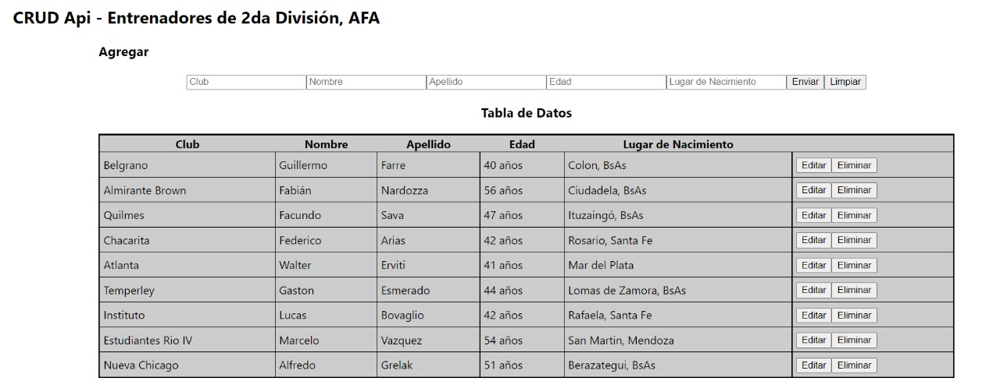

# useContext

# aplicación CON Context API

Context provee una forma de pasar datos a través del árbol de componentes sin tener que pasar props manualmente en cada nivel.

`Para correr el crud:`

### `npm run fake-api`

Crud Api con useContext

Cambio de lenguajes, modo claro/oscuro y simulacion de inicio de sesión

### `Gracias JM!`
